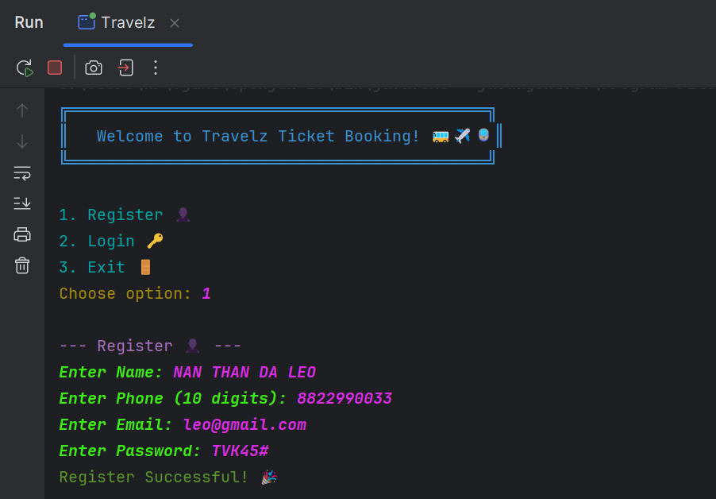
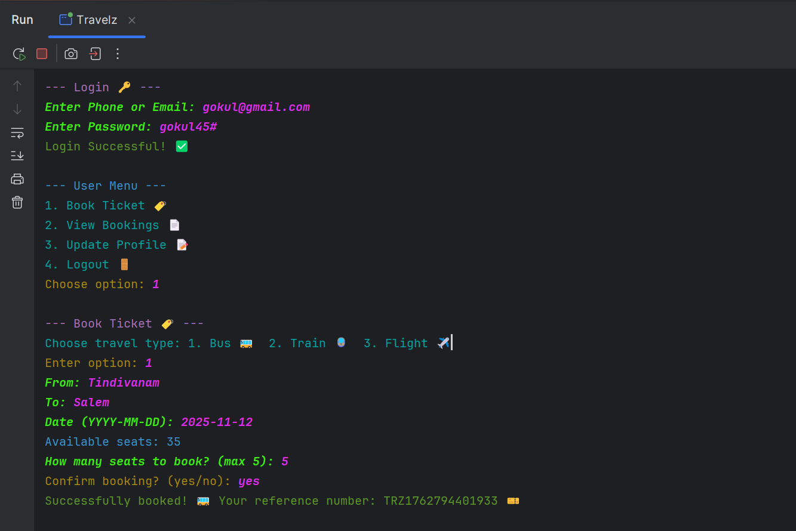

# Travelz Ticket Booking System⚡🤠

A colorful, emoji-rich Java console application for booking bus, train, and flight tickets with MySQL database.

Features
--------
- User registration/login (with password hash)
- Book tickets (Bus 🚌, Train 🚆, Flight ✈️)
- View, search, export, and cancel bookings
- Admin panel (view/delete users/bookings)
- Colorful and emoji output

Screenshots
-----------

Requirements
------------
- Java JDK 8 or above
- MySQL Server
- MySQL Connector/J (JDBC driver)

Setup Instructions
------------------
1. Clone or Download the Project
   - git clone https://github.com/Gokul-45/Ticket-Booking-System.git
   - Or download the ZIP and extract.

2. Database Setup
   - Open MySQL Workbench or command line.
   - Run the SQL in database.sql file.

3. Download MySQL Connector/J
   - Download from: https://dev.mysql.com/downloads/connector/j/
   - or use this 
   - Extract and note the path to the .jar file (e.g., mysql-connector-java-8.0.xx.jar).

4. Open Project in IntelliJ IDEA (or any Java IDE)
   - Open the project folder.
   - Add the provided Java file (Travelz.java) to the src folder.

5. Add MySQL Connector/J to Project
   - Go to File > Project Structure > Modules > Dependencies.
   - Click the + button, select JARs or directories.
   - Choose the downloaded mysql-connector-java-8.0.xx.jar file.
   - Click OK and Apply.

6. Update Database Credentials
   - In Travelz.java, update these lines with your MySQL username and password:

     static final String DB_URL = "jdbc:mysql://localhost:3306/travel";
     static final String USER = "root"; // your MySQL username
     static final String PASS = "your_password"; // your MySQL password

7. Run the Application
   - Right-click on Travelz.java and select Run.
   - Or use the green play button in IntelliJ.

How to Use
----------
- Register with your name, phone, email, and password.
- Login using your phone/email and password.
- Book tickets by entering travel type, from, to, date, and number of seats.
- View bookings (search, export, cancel).
- Admin can view/delete users and bookings.(reg email: admin@travelz.com, pass: admin123)
- Logout or Exit when done.

Troubleshooting
---------------
  - If you get a database connection error, check:
  - MySQL is running.
  - Database and tables are created.
  - Username/password are correct.
  - MySQL Connector/J is added to the project.

Contributing
------------
Feel free to fork this repository and submit pull requests or use the code for your own projects.

License
-------
Educational use only.
